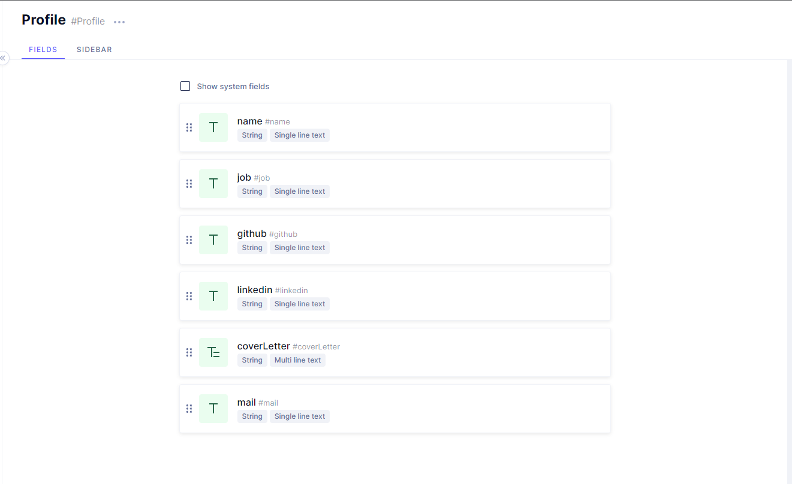
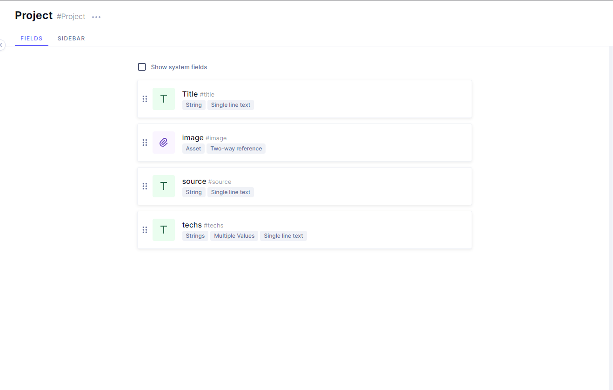

# Portfolio

You can check out my portfolio site on [this link](https://ersincakmak.netlify.app/).

## Installation

I used [graphcms](https://graphcms.com/) for the content. First you need to create an account after that create an app and then create profile and project schemas.

After these things your schemas should be like below

### Profile Schema



### Project Schema



And then you need to create documents from them.

### env setup

First you need to create .env file in the root directory of the project. Then you need to fill it like below

```
REACT_APP_PROFILE_ID={{this is your profile id that you craete}}
REACT_APP_GRAPHQL_ENDPOINT={{your graphcms public content api endpoint}}
```

Finally completed the setup and you can start this command

```
npm run install && npm run start
```
